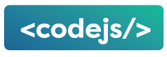

[](https://travis-ci.org/odeum/odeum-codejs)
# 1. ODEUM CodeJS

<a href="https://github.com/odeum/odeum-codejs">
  
</a>
<br />

**ODEUM CodeJS** is a Web Application Frontend Framework based on React.

<!-- TOC -->

- [1. ODEUM CodeJS](#1-odeum-codejs)
- [2. Introduction](#2-introduction)
    - [2.1. CASE: New ODEUM frontend design](#21-case-new-odeum-frontend-design)
    - [2.2. Enter React](#22-enter-react)
    - [2.3. For more details and involvement in our open source project please contact:](#23-for-more-details-and-involvement-in-our-open-source-project-please-contact)
        - [2.3.1. Check out the Google presentation for the case/problem:](#231-check-out-the-google-presentation-for-the-caseproblem)
        - [2.3.2. Read our Guidelines and reference guides:](#232-read-our-guidelines-and-reference-guides)
- [3. Mission Statement](#3-mission-statement)

<!-- /TOC -->

# 2. Introduction

## 2.1. CASE: New ODEUM frontend design

```
ODEUM is a cloud-based development platform for designing and developing 
mobile and web applications / services that help professional designers 
and developers to create innovative solutions.
```

* “Our existing Web App UX frontend is deprecated and part of a huge monolithic LAMP stack Web Application”
* “We want a new design with better UX, faster and easier to use and understand”
* We want to be able to fast prototyping and develop new Web Apps very fast
* “Single-Page-Application (SPA) design with intelligent routing for deep-linking”
* “Reuse of existing ODEUM backend (PHP/MySQL) through Restful API”
* “Facilitate existing powerful JS view libraries with community traction”
* “A component based architecture optimized for reuse for all ODEUM Apps (web/mobile)”
* “Open Source technology with super fast evolving and positive appraisal”

## 2.2. Enter React

* “ReactJS and React Native looks promising”
* “Component based model with encapsulation of design and functionality (colocation) - write once - use everywhere”
* “Exciting community with tons of eye-balling free stuff” (and loads of JavaScript fatique to follow)
* “Possibility to reuse technical knowledge with React Native for mobile apps”
* “Top tier company approval (FB, Instagram, Twitter, Netflix, AirBnB, Microsoft and many others)”
* “… and probably much more!”

## 2.3. For more details and involvement in our open source project please contact: 

```
ReactDOM.render(<Contact mail="cb@webhouse.dk" 
phone=”+45 22 68 08 80” github="odeum-codejs" />, 
document.getElementById("odeum-codejs"))
```

### 2.3.1. Check out the Google presentation for the case/problem:

* <a href="http://bit.ly/2kt6mpR" target="_blank">Decomposing a new design into ODEUM CodeJS</a>

### 2.3.2. Read our Guidelines and reference guides:

* <a href="./docs/Guidelines.md" target="_blank">ODEUM CodeJS Guidelines</a>


# 3. Mission Statement

At WebHouse we set out on a mission in 2016. 

A mission, not just to renew our existing Web UI and UX of our long product-line of ODEUM Web Apps, 
but a mission to do something amazing. Something new, something exiting, and through that mission give something back 
to a development community we have been a part of since 1995. 

The idea of ODEUM CodeJS originated in the need for a new UI and UX for ODEUM Web Apps. This idea evolved slowly into, not just wanting to produce something that we would own and be able to use, but something that others would be able to use and contribute to.

So the idea of open sourcing our work began to evolve. And the ideas just kept flowing in.

- We Love to Code
- We Love Open Source
- We Love Aalborg, the city we live and thrive in
- We Love ... React

So the mission is to make a kick-ass Web Application Frontend Framework based on React. 

Made with Love for JavaScript and React, made with passion and help from our friends in Aalborg.

Made in Aalborg.

So if you are a passionate ReactJS or JavaScript developer and would like to contribute to the first React open source Web Apps UI/UX framework project in Aalborg please let us know @ <a href="mailto:cb@webhouse.dk" target="_blank">cb@webhouse.dk</a> 

More on how to contribute later ... 

Thanks

The ODEUM CodeJS Team


Please note that this project is released with a [Contributor Code of Conduct](code-of-conduct.md). By participating in this project you agree to abide by its terms.
